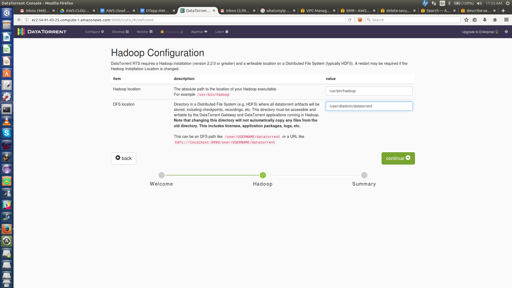

## Overview
This document describes steps to run DT apps on AWS cluster. Users can easily try out apps from app hub by downloading the app installers from the DataTorrent website. A zip package containing bash scripts will be downloaded on user’s machine and user needs to follow the instructions below to deploy apps.

## Setup
+ Install the AWS Command Line Interface
    + Refer to the [link](http://docs.aws.amazon.com/cli/latest/userguide/installing.html) for instructions
+ Configure the AWS Command Line Interface
    + Refer to the [link](http://docs.aws.amazon.com/cli/latest/userguide/cli-chap-getting-started.html#cli-quick-configuration) for instructions
+ Verify that AWS Command Line Interface is configured by ensuring the following returns correct values.

        aws configure get aws_access_key_id
        aws configure get aws_secret_access_key
        aws configure get region

## Package contents
The zip file (see [end-to-end steps](#end-to-end-workflow) below) will contain following files:

- **DTapp-EMR-Deploy.sh** - Script that user needs to execute to set up AWS EMR Cluster. The cluster will be created, DT-RTS will be installed with the app.

- **config.properties** - This file contains properties used by the script. File has sample values for the properties as mentioned below.

<table>
    <colgroup>
        <col width="33%" />
        <col width="33%" />
        <col width="33%" />
    </colgroup>
    <tbody>
        <tr class="even">
            <th>Property</th>
            <th>Sample Value</th>
            <th>Description</th>
        </tr>
        <tr class="odd">
            <td align="left">SECURITY_GROUP_NAME</td>
            <td align="left">DTapp-security-group</td>
            <td align="left">Security Group with this name will be created and inbound rule with user machine’s external IP address will be added to it.</td>
        </tr>
        <tr class="even">
            <td align="left">BUCKET_NAME</td>
            <td align="left">DTapp-EMR</td>
            <td align="left">S3 bucket name. A bucket with this name will be created and script that installs DT-RTS will be placed into it. This script is used as a bootstrap script during cluster launch.</td>
        </tr>
        <tr class="odd">
            <td align="left">S3_REGION</td>
            <td align="left">us-east-1</td>
            <td align="left">Region where S3 bucket is created</td>
        </tr>
        <tr class="even">
            <td align="left">LOG_URI</td>
            <td align="left">s3n://DTapp-logs</td>
            <td align="left">S3 URI where log files would be stored</td>
        </tr>
        <tr class="odd">
            <td align="left">CLUSTER_NAME</td>
            <td align="left">DTapp</td>
            <td align="left">Name of the EMR cluster</td>
        </tr>
        <tr class="even">
            <td align="left">CORE_INSTANCE_TYPE</td>
            <td align="left">m1.large</td>
            <td align="left">Type of machine for core instance</td>
        </tr>
        <tr class="odd">
            <td align="left">CORE_INSTANCE_COUNT</td>
            <td align="left">1</td>
            <td align="left">Number of core instances to be created</td>
        </tr>
        <tr class="even">
            <td align="left">MASTER_INSTANCE_TYPE</td>
            <td align="left">m1.medium</td>
            <td align="left">Type of machine for master instance</td>
        </tr>
        <tr class="odd">
            <td align="left">MASTER_INSTANCE_COUNT</td>
            <td align="left">1</td>
            <td align="left">Number of Master instances to be created</td>
        </tr>
    </tbody>
</table>

- **DTapp-EMR-Terminate.sh** - Script to terminate the cluster

## End to End workflow
1. Download the zip file for the app. [https://www.datatorrent.com/downloads/aws-apps/app-hdfs-sync.zip](https://www.datatorrent.com/downloads/aws-apps/app-hdfs-sync.zip)

2. Extract the zip

3. Verify the files. The directory structure should be as follows:

        user@localhost:~/Downloads/app-hdfs-sync$ ls
        config.properties  DTapp-EMR-Deploy.sh  DTapp-EMR-Terminate.sh

4. Edit config.properties files. Modify the properties as described in the [Package Contents](#package-contents) section.

5. Assign Execute permissions.

         user@localhost:~/Downloads/app-hdfs-sync$ chmod u+x DTapp-EMR-*

6. Execute the shell script.

         user@localhost:~/Downloads/app-hdfs-sync$ ./DTapp-EMR-Deploy.sh

7. Wait till the EMR cluster is up. Once the cluster is up, a link to configure the DT-RTS will be provided. Click on the link. E.g  `http://ec2-54-91-43-25.compute-1.amazonaws.com:9090`

8. DT-RTS Welcome Screen will appear
  

9. Setup the DT-RTS by adding Hadoop location e.g `/usr/bin/hadoop` and DFS location e.g. `/user/dtadmin/datatorrent`. Click Continue
  

10. Once the configuration is complete, Click Continue
  

11. The app is imported and is ready to launch
  

12. To terminate the app, execute the termination script:

         user@localhost:~/Downloads/app-hdfs-sync$ ./DTapp-EMR-Terminate.sh
